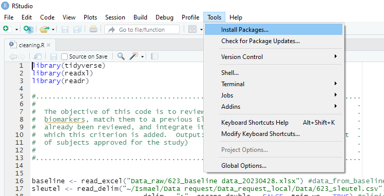
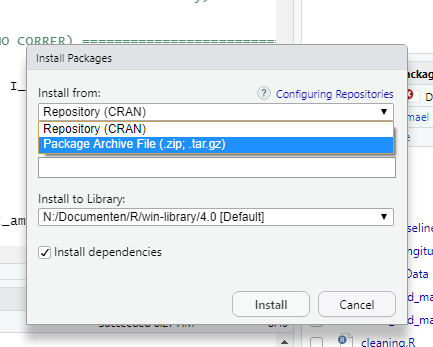
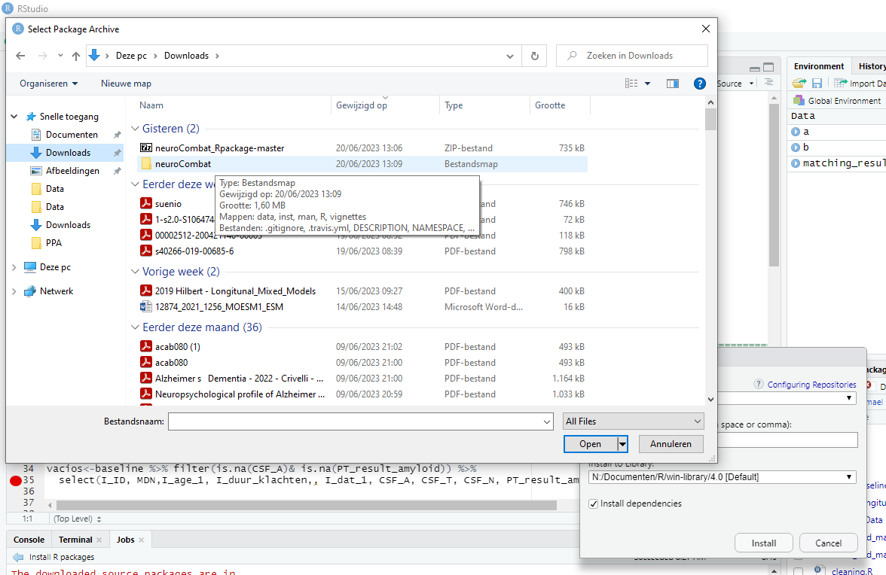

# Neurocombat R package :bomb:
A compiled version of  Jean-Philippe Fortin package compiled to work in R.  From https://github.com/Jfortin1/ComBatHarmonization/tree/master/R 

For examples and documentation please see author github page:
https://github.com/Jfortin1/ComBatHarmonization

How to install:

1. Download the code to your computer (make sure to unzip it after that)
2. Open RStudio and go to Tools -> Install Packages in the menu
   
   
   
3. Change "Install from" to archive

   
   
4. Look in to your download folder for the archive call "neuroCombat_1.0.13.tar.gz" (if you unzip, maybe it is into a folder called as zip file)
   
   
